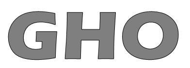

# GHO : Greedy Approch Based Hyperpameter Optimization

    

## Keywords
`greedy algorithm`, `deep learning`, `neural networks`, `online learning`, `hyperparameter optimization`, `edge device`, `Jetson Nano`
